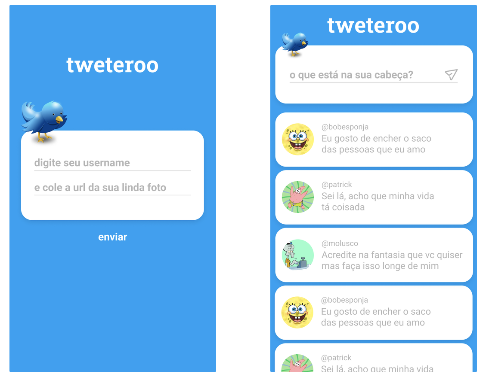

<h1 align="center">API Tweteroo - Node </h1>

✅ Requisitos
- Geral
    - [ ]  A porta utilizada pelo seu servidor deve ser a 5000.
    - [ ]  Versionamento usando Git é obrigatório, crie um **repositório público** no seu perfil do GitHub **apenas com o código do backend.**
    - [ ]  Faça commits a cada funcionalidade implementada.
    - [ ]  Não esqueça de criar o `.gitignore`, a `node_modules` não deve ser commitada.
    - [ ]  Seu projeto deve ter, obrigatoriamente, os arquivos `package.json` e `package-lock.json`, que devem estar na raiz do projeto. Eles devem conter todas as **dependências** do projeto.
    - [ ]  Adicione o código que inicia o servidor, com a função `listen`, no arquivo `src/app.js`.
    - [ ]  Adicione um script no `package.json` para iniciar o servidor rodando `npm start` como no exemplo abaixo:
        
        ```json
        // package.json
        {
          //...
          "scripts": {
            //...
            "start": "node ./src/app.js"
          }
        }
        ```
        
- Armazenamento e formato dos dados
    - [ ]  Para persistir os dados (usuários e tweets), **utilize variáveis globais em memória.**
    - [ ]  O formato de um **usuário** deve ser:
        
        ```jsx
        {
        	username: 'bobesponja', 
        	avatar: "https://cdn.shopify.com/s/files/1/0150/0643/3380/files/Screen_Shot_2019-07-01_at_11.35.42_AM_370x230@2x.png" 
        }
        ```
        
    - [ ]  O formato de um **tweet** deve ser:
        
        ```jsx
        {
        	username: "bobesponja",
          tweet: "Eu amo hambúrguer de siri!"
        }
        ```
        
- **POST** `/sign-up`
    - [ ]  Deve receber (pelo `body` da request), um parâmetro **username** e um **avatar**, contendo o nome do username do usuário e a sua foto de avatar:
        
        ```jsx
        {
            username: "bobesponja",
        		avatar: "https://cdn.shopify.com/s/files/1/0150/0643/3380/files/Screen_Shot_2019-07-01_at_11.35.42_AM_370x230@2x.png"
        }
        ```
        
    - [ ]  Salvar esse usuário num array de usuários do servidor.
    - [ ]  Por fim, retornar a mensagem `“OK”`.
- **POST** `/tweets`
    - [ ]  Se o usuário não estiver cadastrado (username não fez `sign-up` anteriormente), deve retornar a mensagem `“UNAUTHORIZED”`.
    - [ ]  Deve receber (pelo `body` da request), os parâmetros `username` e `tweet`:
        
        ```jsx
        {
        	username: "bobesponja",
          tweet: "Eu amo hambúrguer de siri!"
        }
        ```
        
    - [ ]  Salvar esse tweet num array de tweets do servidor.
    - [ ]  Por fim, retornar a mensagem `“OK”`.
- **GET** `/tweets`
    - [ ]  Retornar os 10 últimos tweets publicados
        
        ```jsx
        [
        	{
        		username: "bobesponja",
        		avatar: "https://cdn.shopify.com/s/files/1/0150/0643/3380/files/Screen_Shot_2019-07-01_at_11.35.42_AM_370x230@2x.png",
        		tweet: "Eu amo hambúrguer de siri!"
        	}
        ]
        ```
        
    - Repare que a informação “avatar” **não vem** da requisição **POST** de `/tweets`. Para retornar o “avatar” na requisição **get** de `/tweets`, você vai precisar obtê-lo de outra forma.
    - [ ]  Caso não tenha nenhum tweet cadastrado, retorna um array vazio.
<hr/>

## 🛠 &nbsp;Skills
<div align="center">
 
        
  
  
  
                                     
</div>
<hr/>

## 🚀 &nbsp;Links

- [Figma]().<br/>
- [Deploy]().<br/>

<hr/>

## 💬 &nbsp;Contact


Feito por [Raissa Curty](https://github.com/curtyraissa)!

<a href="https://www.linkedin.com/in/raissa-curty/" target="_blank">
    
</a>&nbsp;